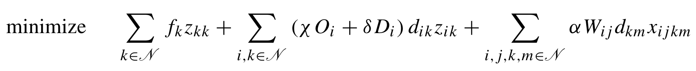

https://doi.org/10.1007/978-3-030-64018-7_18

4indx run for more than 1 hour

> model.addConstr(2 * x[i, j, k, l] <= (y[i, k] + y[j, l]))

this helps, it reduces the constraints number.

# Analyse
## Number of variables and constraints
O()
Optimize a model with 211 rows, 1100 columns and 3090 nonzeros  
Variable types: 1000 continuous, 100 integer (100 binary)  

Presolve removed 10 rows and 100 columns
Presolve time: 0.01s
Presolved: 201 rows, 1000 columns, 3090 nonzeros
Variable types: 900 continuous, 100 integer (100 binary)

Presolve removed 20 rows and 100 columns
Presolve time: 0.01s
Presolved: 191 rows, 1000 columns, 2810 nonzeros

Optimize a model with 10211 rows, 10100 columns and 40190 nonzeros  
Variable types: 0 continuous, 10100 integer (10100 binary)

Presolve removed 2730 rows and 2710 columns
Presolve time: 0.85s
Presolved: 7481 rows, 7390 columns, 29630 nonzeros
Variable types: 0 continuous, 7390 integer (7390 binary)

Presolve removed 10 rows and 0 columns
Presolve time: 0.02s
Presolved: 10201 rows, 10100 columns, 40190 nonzeros

## LP-relaxation
which oen is stronger

### Branch-and-Bound tree
if we set off cutting planes

